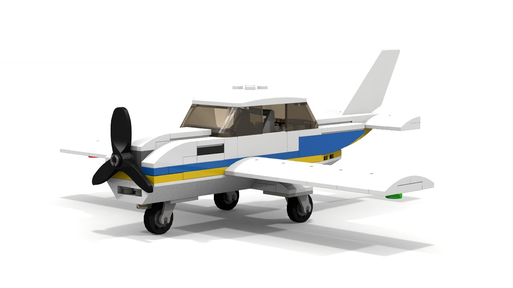
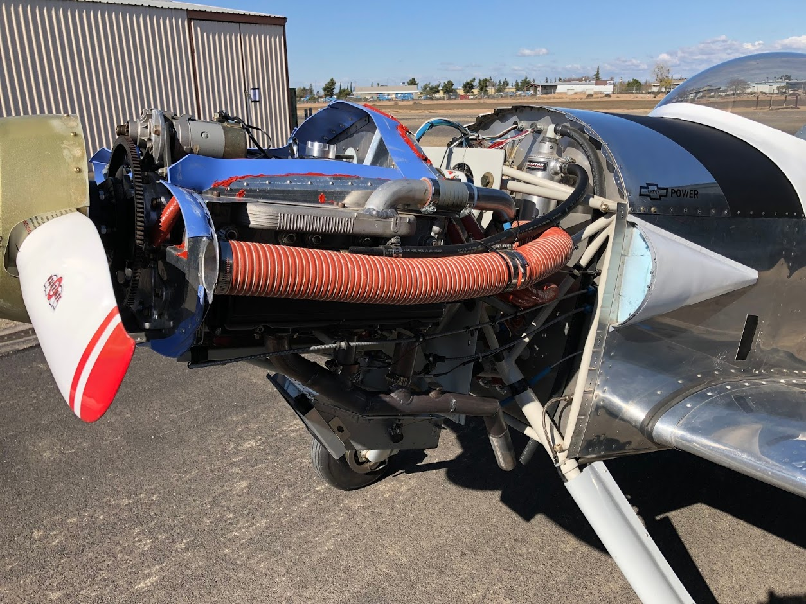

# Aerovair
A homebuilt aeroplane you can drive home

# The mythical flying-car and the unobtanium affect 
There have been many attempts at making a "flying car", [so many, it's not worth listing](http://lmgtfy.com/?q=flying+car).

If one does absolutely everything perfectly, you end up with some chitty-chitty-contraption that's a meagre air plane and a poor excuse for an auto mobile.  So, let's start there with the bar set __WAY__ _Way_ way low.  If you are still reading, it's because you are OK with sacrificing modern automotive convenience and the last 20% of an aircraft performance just so you can have one vehicle that is capable of parking in your garage, driving you to the nearest public airport so you can go flying.

There are three current "way out there" concept vehicles in the popular media that have demonstrated some capability to fly and drive.  ___BUT___ ... you won't see them unless you have something over $500,000 USD handy _AND_ you're willing to wait 5+ years.  And with history as a guide, none of actually made it to any manufactured volume ever :(

Hey, there is a proactive, do-it-yourself, alternative.  Build it!  Anyone can build/fly a homebuilt aircraft or build/drive a kit car right now, today.  So... what's stopping us?  It's a matter of practical engineering, tears sweet and yeah some blood.

# Goals
## Initial
* Can fly up to 900 miles at 150mph
* Can drive up to 5 miles all electric on batteries
* Can run the gasoline motor to regenerate electricity to continue driving 
* Can convert to and from flying and driving modes in under one minutes. 

## Future
* Clutched propeller so battery charge regeneration can occur without the propeller spinning
* Mode conversion is actuated and you don't have to leave the cockpit
* You can drive up to 600 miles without stopping

# A car that can fly or a plane that can drive?
## It's air plane that drives a little
One has to find a starting point and I like a plane that can drive.  Here's why...

* I purposely prejudice the primary mission as flying, not driving.  Driving is secondary to achieve improved logistics.
* It's much easier to take something lightweight (aircraft) and make it do more stuff (add weight) than the other way around.
* The fundamental engineering requirements of flight are orders of magnitude harder to achieve than the fundamentals of every-day driving.

## How do you fly and drive it?
### Flying is stick, rudder and throttle, just like an air plane.  No Change.

### Driving is a bit more tricky... 
For the record... we pilots "drive" air planes all the time, it's called taxiing.  Using our feet we steer on the ground with the rudder pedals steering the third wheel.  We also have differential (left/right) brakes on the tops of both rudder pedals.  When we wish to slow down rapidly (like after touchdown) we push on both tip-toes and the brakes engage proportional to the pressure applied.  At slow speeds, maneuver in tight spaces, we can press either brake to pivot on less than a dime.

### Let's just extend that principal...  
So let's say you use your feet to steer, even when you're driving.  It works great... trust me if you're not a pilot.  The real trick is how to set the speed forward and backward and how to ensure the engine doesn't start when you don't want it to.  We can do all that on the throttle itself.  Some aircraft have propellers that can go into "reverse" it's called _beta_.  The standard aircraft control for engaging this _beta_ is to use a mechanical throttle lock at the bottom of the throttle.  So you pull back on the throttle while holding a mechanical stop-override and the throttle slips backward into a "negative" position.  This is how I'd engage reverse on the ground and it would only allow crawlingly slow speeds (2mph).

### What about the engine?
While on the ground when the wings are folded and the propeller is disengaged from the engine by a automatic clutch, the gas engine will start and stop on the demand of the battery system automatically.  This is similar to gen-set electric hybrids like the Chevrolet volt. 

# Airframe
The choice of homebuilt airframes is arbitrary, but the initial airframe will begin with a Van's RV-4.  As airframes go, this is a particularly light weight airframe that has enabled a very wide flight envelope.  It gives the best chance of achieving good flying qualities with all the additional compoents mandated by being able to drive on the highway.

## What is staying the same..
* Empennage
* Fuselage 
* The majority of the wing structure

## What is being altered...
* [Engine will be a gasoline-electric hybrid](#power-plant)
* Landing gear - The stock engine-mount landing gear will be removed and converted to leaf-spring with linkage for steered main wheels.  The tail wheel will be fixed, large and driven by a modest electric motor.  This will give improved road stability landing/driving handling more like a Can-Am Spyder.  This should stability should lower the tricycle gear instability associated with ground-looping.
* [Wing will be modified to support folding](#the-wing-is-the-thing)
* Fuel system - The stock fuel tanks are too wide to fit in the typical road vehicle width, even with the wings hinged.  They will need to be shorted.  To compensate, a third small header tank will be added above the pilots feet and under the glare shield where the main tank is on the legacy RV-3.  You can not externally fill this tankas it will be fed by two low pressure fuel pumps from the either wing tanks. It will also serve to create a very reliable and low head pressure for the injection system.

# The wing is the thing
The wing design is critical to how it flies and how much you can't see when you drive.

## Hinging
### There are many ways to hinge a wing and the right way really makes the ship... Goal:
* Ease of driving
* Driver visibility
* Ease of transition
* Complexity
* Strength and weight
* Rigging/de-rigging

### Here are some common hinging techniques;
* __Straight vertical hing__ This is a very simple way to hing a wing and it's common for aircraft that want a simple way to become compact.  Unfortunately it typically hinges directly into the lateral line of sight of the pilot and would mean you can't see anyone to your left/right while driving. It's also very tall and acts as a top-heavy sale, which would interfere with driving.

* __Rotating aft hinging__ This is common in high wings where the strut acts as a brace.  It does fold well behind the pilot, giving unobstructed lateral visibility and it could be made to work well.  It is a strong contender.  The forces of transition are high (you must hold the tip while folding) but this is not a huge factor.  It is a bit more complicated and has more parts in the wing, it also works better with strut braced aircraft, not low-wings, but it can be made to work.

* __Stow-a-wing__ This was invented in the pre-WWII years by Grumman aircraft to compactly stow planes on an aircraft carrier.  It is a simple single-hinge system that simulations pivots longitudinally and laterally on one compound axis so the wing fits nicely against the empennage.  It has low parts, very low transition energy, a person or an actuator can exercise it.

[View these pictures to see many more...](images)

### Conclusion
For all these reasons, the Stow-a-wing system is superior.  The controls can stay connected, the pivot system is strong, simple and compact and the drive has maximum visibility. 

## Wing alteration
To support the Stow-a-wing hinge requires a very odd cut into the aft spar, diagonal both laterally and longitudinally.  Approximate inclinations for both axis are known, but final designs will have to be determined experimentally on a 3D model. 

# Power plant
The power plant includes gasoline engine, electric motor/generator, batteries, drive-wheel motor and all electronics to support those systems.

## Gasoline Engine
The ideal engine is one designed around the requirements of an aircraft but robust and extensible.  There are many choices and one could make great arguments for many other engine choices.  But for this project the Corvair was chosen;

* Readily available and commonly converted, which means there's a large audience of very hands-on knowledgeable experts on the every aspect of this engine.
* Simplistic engine layout, intake on top, exhaust on the bottom, cam is always bathed in oil.  I like all that.
* Robust in two ways... It can take punishment, it was an aircraft-inspired automotive engine.  It can take an astonishing amount of abuse and continue to run.  It is robust in the ability to adapt it's core components.  I can easily attach a rear-mounted hybrid electric motor and it is directly connected to the shaft and transferring torque energy to the propeller.  No common aircraft engines have exposed rear shafts and adding a motor in the way would be difficult.

## Motors
A 40kw brushless DC motor will be adapted to fit to the rear of the engine to serve three functions;
* Start the motor
* Drive the crankshaft to increase power when required allowing the engine to use a larger more efficient prop
* Generate electricity to feed the primary high voltage battery system

A 20kw brushless DC motor will be attached to the fixed tail wheel.  This will drive the vehicle when running the engine (spinning prop) is inappropriate; congested areas or parking.  It will also allow for reverse speeds.  It will be strong enough to drive the vehicle at speeds up to 50mph.  Speeds above 50mph could easily be augmented by running the gas engine with the spinning prop in controlled highway environments and when road debris is not an imminent concern.   This same motor will provide primary braking for all normal braking.  A secondary emergency "scrub" backup/parking brake will engage the tail wheel directly and mechanically.

## Battery
A 6kwh Lithium Iron Phosphate (LiFePo4) battery pack will be placed near the nose of the aircraft.  It can be ground charged by a built in 120/240vac charger for short trips, but ultimately serves to buffer the motor and provide limitted all-electric driving capability.

## Electronics
The gasoline engine will be fully electronically controlled and every motor will have an electronic inverter/controller.  They will be connected to the power plant management computer which is responsible for the orchestration of all these systems to start, stop and run the engine and manage the flow and reserve of electricity to and from the motors and battery.

## Turbo electric compounding hybrid (TECH)
This is honestly a stretch goal and the most "novel" system I've re-discovered with a modern twist.  Before jet propulsion overtook piston engines, the final piston efficiency innovations of the internal combustion engines, was "Turbo Compound".  This utilized wasted heat energy from the exhaust to spin a turbine that was carefully geared to feed energy back into the crankshaft boosted the specific efficiency of the ICEs by up to 15%.

Due to it's cost complexity and maintenance the concept didn't stick and faded into aviation history.  But the idea is compelling and I'm going to revisit it with a contemporary update.  

Begin with an off-the-shelf turbocharger.  
    Increase the size of the turbine side to purposely overpower the compression blade.
      Finally add a small high RPM BLDC motor of approximately 9kw to the turbine shaft

This performs these critical roles;
* Excess waste turbine energy is extracted through the motor/generator and fed to the battery and ultimately consumed by the engine-crank-driven-motor.  Overall power plant efficiency will improve (BSFC).
* The BLDC can very precisely control RPM eliminates surging, stalling and over boost while keeping the combustion side within fuel and induction pressure parameters to ensure minimizing detonation
* Throttle body elimination. The compressor at low engine RPMs will be purposely slowed by the turbine motor controller to restrict airflow inducing a partial vacuum similar to a restricted throttle body.  The fuel can be nozzle-fed upstream of the compressor blade, which will "blend" the fuel and air very completely and without any induction induced atmospheric icing (carburettor icing).  The engine controller will precisely ration fuel in proportion to intake air using a mapping table of  power-demand, intake temperature, atmospheric pressure, turbine speed and engine RPM.

# Known Issues

* The main gear attachment, wheel hub and steering arm are going to be complicated and require consultation and modelling
* The exact design of the hinge is complicated and requires complex stress analysis and testing.  Consultation with an structural engineering expert will be required
* Turbo sizing is hard... this size engine at these speeds barely fits common turbochargers.  Consultation with experts will be required
