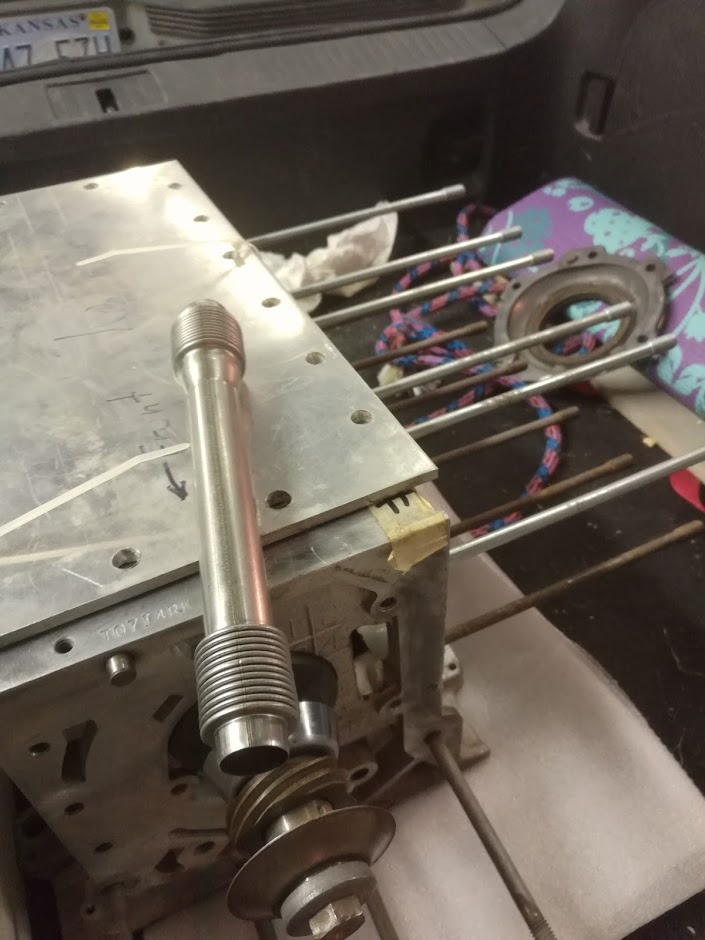
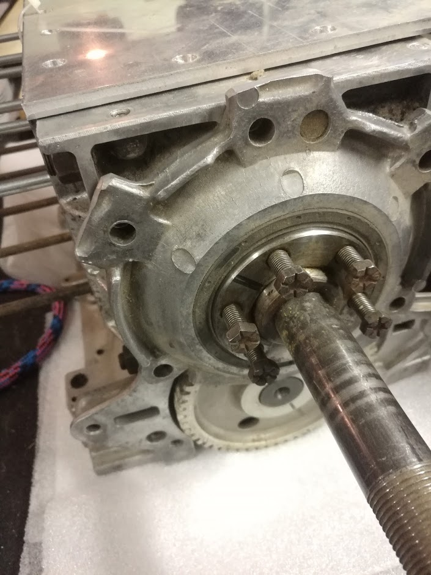

# The Project

## Wing

I purchased an RV-4 wing kit partially completed by an A&P for $1,000. 

## Fuselage

I purchased a very damaged RV-4 aiframe with an additional wing.  I may use the wing, but I will likely scrap it.

I bought the project because it has a _LOT_ of hardware that's expensive.  It has a canopy frame, and most ribs are probably usable.  I can use those longerons and ribs a template to rebuild this fuselage faster than building one from raw stock (the normal RV way).   So it's going to save me some time.

I can purchase the new skins from airparts inc for $900.

## Cost 

So Far, here's what I've got;

------------|-----
Wing/tail   | $1000 
Fuse        | $1500
Engine      | $600
Wheels      | $750
Carb        | $150

What I will need (rought dollar estimate +/- 10%)

-------|-------------|-----
Engine               |
       | 5th Bearing | $1200
       | Flang       | $200
       | Mount       | $300
       | Prop        | $1200
       | Exhaust     | $700
       | FAB         | $200
       | Oil Cooler  | $200
       | Oil Lines   | $150
       | Turbo       | $800
Fuse                 |
       | Canopy      | $550
       | Cowl (me)   | $200
       | Instruments | Free (have them)

# 3/3/2018 - Airframe

I got this airframe for basically scrap price.  The tail is a total loss.  The remainder is very nearly scrap.

# 2/20/2018 - Corvair engine

I picked up this half converted corvair engine.  It needs the 5th bearing added assembled and test run.

